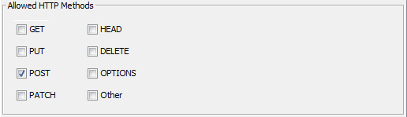
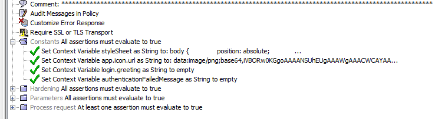
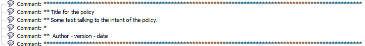

# Gateway Policy Development Standards

The aim of this document is to provide a starting point for the creation of CA API Gateway policy development standards. It maybe particularly useful to new users of the Gateway. These standards are designed primarily to ensure a consistent approach to policy naming and configuration to maximise the supportability and readability of policies while ensuring consistent quality of the implementation. Like any standard, it's open to interpretation and should be grown by your own business to cover domain specific requirements.

If you find the document useful or want to talk more about these ideas, please feel free to reach out to me via email at benjerrim@me.com.

### API Namespaces
The namespaces (or resolution paths) of the API should be reflected exactly in the policy tree inside policy manager. This is not mandated by the tool but should be considered a standard and is detailed further under the Policy Naming section below. Complying with this standard makes it much easier for new comers to support the API as finding the policy is trivial once the URI is known. Use folders to do this a appropriate.

The actual namespacing of the API resolution paths is very domain specific and should be developed by a team with a good understanding of RESTful design patterns and an understanding of your business.

With that said, consider separating parts of the API that perform and simply proxying functionality to those that add real business value to digital initiatives. like:

#### /api/*

This part of the policy tree can be dedicated to publishing resources that follow a RESTful pattern and offer value to more than one consumer. Policies in this part of the API tend to have value added by the gateway through data transformation or high levels of abstraction from the sources systems. The namespaces here may evolve threw a domain driven design approach that helps catalogue resources according to their business domain and value. Careful consideration should been made when defining 'resources' and the business domain they fall within.

Versioning is not performed within this part of the API so changes should be non-breaking (We live in hope anyway!).

#### /service-proxy/*
This part of the API can support publishing and securing bespoke services that the gateway does not improve or abstract from the consumer. The name spacing below /service-proxy/ tends to group policies by the application hosting the service. These tend to be SOAP services but are not exclusively so.

Versioning may be required under this part of the API and is generally easy to manage as these services tend to only have one consumer.

#### /sso/*
All Single Sign On endpoints can exist in this part of the policy tree.

#### /webapps/*
The gateway performs a good job at reverse proxying web applications and re-writing urls to abstract source system specific hostnames and paths.

### Policy Naming

The follow naming rules apply to all policies.
* Policies should be named using all lowercase letters
*	Resolution paths should be defined using all lowercase letters
* The resolution path and the policies location in the policy tree should match
* The final static node of the resolution path should be the name of the policy including the '/'
* Where the policy publishes a RESTful resource, the resource should be named as a plural.
Camel casing the policy name and resolution path makes for hard to read URI's and creates a potential area of confusion for consumers in applications that do not have case sensitive URI's (SAP for example). Taking the case variable out of the policy naming equation minimises this unnecessary confusion and also makes URI's easier to type! The use of a plural for defining RESTful resources makes for a meaningful URI when singular resources are appended. For example some/path/to/things and some/path/to/things/30004322.

##### Examples
GOOD

/service-proxy/somesystem/imprortant-attachments	 
The name starts with /, is in lowercase and includes - where necessary to ensure readability

POOR

/service-proxy/SomeSystem/ImprortantAttachment	 
Uses type casing and a singular rather than a plural

/assets	/api/distribution/assets	 Great	Good naming for a RESTful resource. It's business domain is obvious from it's URI and it uses a plural to define the resource
/assets	/api/asset	 Poor	This URI tells the consumer very little about the resource and is not a plural

### Policy Properties
Ensure that only the required methods are enabled for the policy. For example, if the policy does not require support for the GET method (as most SOAP services will not), disable it.

Leaving methods enabled that are not required creates a potential vulnerability in your policy. I've seen this surface in policies that implement business rules around the GET method but leave the routing assertion outside of this logic. Performing a POST to these endpoints may result in the POST routing when the business rules for a GET are not fulfilled.

### Policy Structure
As policies are developed, the policy logic folders should be leveraged to provide a readable structure (see also commenting below). Ideally, the policy should not contain assertions directly in the root of the policy but rather have them encapsulated within a policy logic assertions (At Lease One or All Assertions folder). Following this pattern make the layout of the policy consistent, and also makes the policy logic explicit rather than implicitly falling through the assertion tree.
* The policy should start with a comments block detailing the intent of the policy
* The policy should start with assertions that relate to hardening (like SQL/Cross site scripting protection) followed by Authentication where appropriate.
* Attention should be payed to capturing and expressing correct error states and relevant HTTP status codes
* Error messages should be returned from the policy and be appropriate. These should not expose details of the underlying application. Say 'Error Routing' rather than 'Error routing to SAP ECC6'
* Consider surfacing errors to Slack or email for policies that are critical and are machine-to-machine

Exceptions to the rule!

There are a few assertions that have a significant impact on the policy logic and these can/should be placed at the start of the policy under the comments to ensure this impact is obvious to users maintaining the policy. These are:
*	"Configure Message Streaming" assertion
*	"Audit Message In Policy" assertion

### Variables, Constants & Passwords
The gateway's ability to set, update and read variables at runtime is very powerful and almost all policies will use this functionality to some extent. Decent and consistent naming of these objects is important and also impacts the quality of the migration between gateways.

#### Cluster Wide Properties
Cluster Wide Properties are used to define constants that are used across different policies and nodes within a cluster. Naming these well is important, especially in relation to policy migration.
* DON'T -  use a property's value in it's name! For example, don't call a property for the sap host name SAP_DEV, call it sap.host so that's still relevant when migrated.
* DO - use lower case to name properties
* DO - start the property name with the system it relates to so all SAP properties sort together.
* DO - use the . syntax to define property names, as per other variables
* DO - use verbose and meaningful names, not acronyms

#### Policy Variables
Policy variables will be used everywhere during policy development, particularly for policies that are publishing resources that are well abstracted from the source system and involve transformation. When creating policy variables:
* DO - use lower case to name variable
* DO - use verbose and meaningful names, not acronyms
* DO - use the . syntax to define detailed names

For example, if we're working with a policy that reads user data from AD, we may want to store the results in context variables for policy processing. The following would be considered a reasonable attempt at naming these variables.
* 	user (maybe the overall message response from AD)
* 	user.username
* 	user.email
* 	user.firstname

#### Constants
Often a policy will have a set of constants that will not be used by other policies and do not make sense to create as Custer Wide Properties. These maybe something like a reference to a cache validity duration, an attribute in a template response that's used multiple times in a policy, or an environment specific value. Such constants should be created with in an All Assertions folder at the top of the policy under the comments and given a comment itself set to 'Constants'.
* DON'T -  Spread constants throughout the policy, it makes them hard to maintain.

This example shows the constants for an sso screens appearance, set at the start of the policy.

#### Passwords
The gateway password vault is a handy and secure way to store and read passwords at runtime. Naming the password is important so that others understand what the password value means and what it's used for. The following standards apply:
* DO - start the name with the system that owns the user record
* DO - use upper case to name the password
* DO - separate the words with an _ character
* DO - include the username in the name
* DO - give the password a meaningful description

For example, the stored password for the SAP user SOME_USER should be 'SAP_SOME_USER'. The use of uppercase and the _ makes the password obvious when it's used in the routing assertion and clearly distinguishes them from other variables. Prefixing the system name helps sort and group passwords together in the vault.

### Commenting
All policy (or policy fragments) must start with a high level comment block that could look something like:

The comment block should:
* Be a concise description of the policies use over one or two lines
* Include a link to the policy documentation
* Include a link to the tests
* Include a creator name, version and creation date - although this is available in the policy history, it's nice to have right up front when viewing a policy.

#### Inline commenting
As mentioned above, the use of folders to group policy logic is encouraged. Commenting these folders to the LEFT with 3-5 words is also encouraged. Doing so allows a new user to quickly view the policy at a high level and understand the 'flow' of the logic implemented. The screen shot under the Constants section shows this idea.

Commenting within the policy folders can be helpful too where logic has been chosen for a specific reason.

### Auditing / Debugging
The auditing assertions are extremely useful in policy debugging but can also place significant load on the gateway database. Probably 50% of the issues I've had with the gateway have been due to the incorrect use of Auditing and subsequent filling of the audit database. Once the database is full, message processing will cease (although a setting has been added to v9.1 that changes this).

If the 'Audit Message In Policy' assertion is used it *MUST* be placed at the top of the policy under the comments. It *MUST* only be enabled for request/response auditing as needed and disabled when not required.
The 'Add Audit Detail' assertion is used a lot and maybe left in policies that are migrated to help debugging as needed. Consider commenting these out in production systems.

*Never* add the 'Audit Message In Policy' assertion to policies that process binary files as the logs will fill very quickly indeed... trust me!
